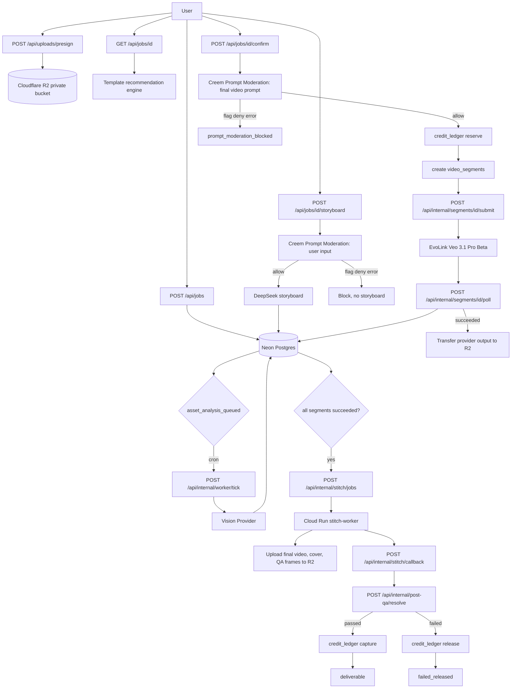
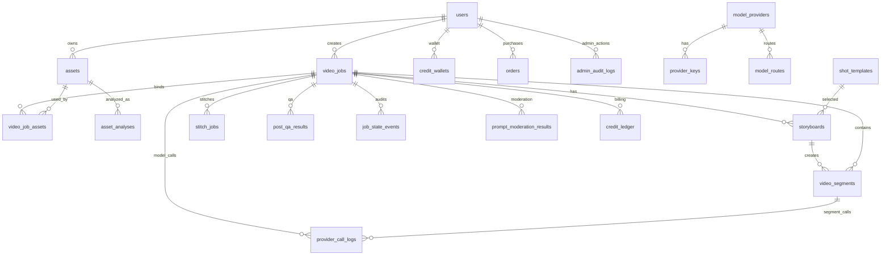
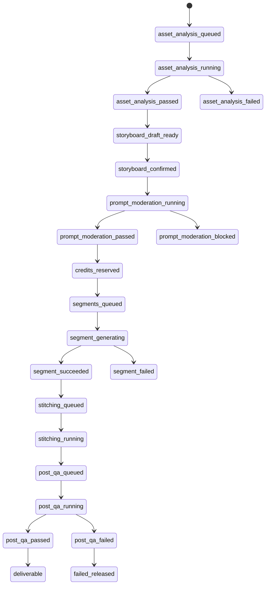

# Backend API Flow and Connection Map

> 当前阶段目标：先完成后台/API 链路，前台和后台 UI 后续再接入。

## API 清单

### 用户侧 API

| API | 用途 | 关键约束 |
| --- | --- | --- |
| `POST /api/uploads/presign` | 创建 R2 私有 bucket 直传 URL 和 asset 记录 | 只保存 R2 key，不保存公开 URL |
| `GET /api/files/signed-url` | 为用户自己的文件生成下载 signed URL | 用户只能访问自己的文件 |
| `POST /api/jobs` | 创建视频任务并绑定素材 | 进入 `asset_analysis_queued` |
| `GET /api/jobs/[id]` | 用户任务详情、素材完整度、模板推荐、最新分镜 | 不暴露 provider key/raw secret |
| `POST /api/jobs/[id]/analyze` | 手动触发素材分析 | 使用真实视觉模型，失败不伪造成功 |
| `POST /api/jobs/[id]/storyboard` | 生成 DeepSeek 分镜草稿 | 用户输入先过 Creem Moderation |
| `POST /api/jobs/[id]/confirm` | 确认分镜、审核最终 prompt、冻结点数、创建 segment | `flag/deny/error` 均阻止生成 |

### 内部 Worker API

| API | 用途 | 关键约束 |
| --- | --- | --- |
| `POST /api/internal/worker/tick` | cron-job.org 推进异步任务 | 校验 `CRON_JOB_SECRET` |
| `POST /api/internal/segments/[id]/submit` | 提交 queued segment 到 EvoLink | 校验 `INTERNAL_WORKER_SECRET` |
| `POST /api/internal/segments/[id]/poll` | 轮询 EvoLink task，成功后转存 R2 | 不永久保存 provider 临时 URL |
| `POST /api/internal/stitch/jobs` | 创建 stitch job | 只在全部 segment 成功后创建 |
| `POST /api/internal/stitch/callback` | Cloud Run 回写拼接、封面、抽帧结果 | Vercel 不跑 ffmpeg |
| `POST /api/internal/post-qa/resolve` | 回写 QA 结论并 capture/release 点数 | QA 通过才正式扣点 |

### 管理后台 API

| API | 用途 | 关键约束 |
| --- | --- | --- |
| `GET /api/admin/jobs/[id]` | 查看任务、segment、provider logs、moderation、ledger、stitch、QA | 需 admin allowlist |
| `POST /api/admin/templates/status` | 暂停/恢复模板 | 调用 `template:update_status` 权限服务 |
| `GET /api/admin/providers` | 查看 provider、key preview、model route | 不返回 encrypted key |
| `POST /api/admin/provider-keys/[id]/status` | 更新 provider key 状态 | 仅 admin，写 `admin_audit_logs` |
| `POST /api/admin/model-routes/[id]` | 更新模型路由状态、模型名、毛利阈值、fallback 开关 | 仅 admin，写 `admin_audit_logs` |
| `GET /api/admin/billing` | 查询钱包、订单、点数流水，可按 userId 过滤 | 只读运维视图 |
| `POST /api/admin/credits/adjust` | 管理员补偿点数 | 写 `credit_ledger.admin_adjust` 和审计日志 |
| `POST /api/admin/segments/[id]/retry` | 重试失败片段 | operator/admin 可用，重置 segment 为 queued |
| `POST /api/admin/jobs/[id]/undeliverable` | 标记任务不可交付并释放冻结点数 | operator/admin 可用，写 release 流水和审计 |

### 运维动作边界

- `POST /api/admin/credits/adjust` 当前只支持正向补点，不支持后台扣减用户点数。
- `POST /api/admin/jobs/[id]/undeliverable` 当前执行平台点数释放，不调用 Creem 原路退款。
- provider key 运维只允许更新状态；新增/轮换密钥需要后续接入加密写入流程，避免明文 key 进入 API 响应或日志。

## 主流程图

## 数据关联图

## 状态机连线

## 现阶段仍需后续补强

- `POST /api/internal/worker/tick` 当前主要处理素材分析；segment submit/poll/stitch/QA 可由内部 API 手动或后续扩展 tick 自动调度。
- provider/key/model-route 已有状态运维 API；新增/轮换 provider key 的加密写入接口仍需单独补。
- pricing 管理接口尚未实现，现阶段点数包仍以代码配置和 Creem 产品配置为准。
- Cloud Run `stitch-worker` 工程目录尚未实现；主应用已提供创建 stitch job 与回调 API。
- Post-QA 当前为结果回写与结算 API；真实视觉 QA 检测服务后续需要接入 provider。
