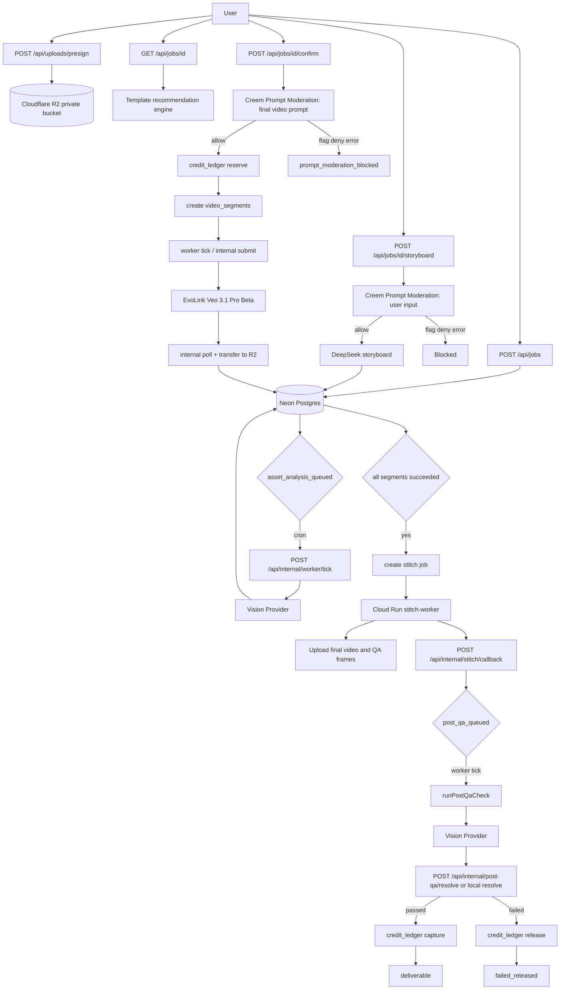
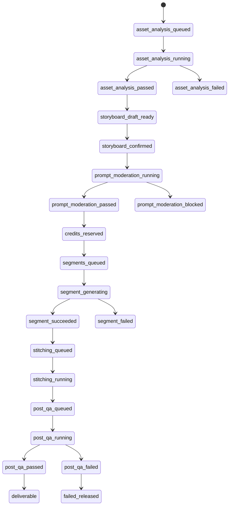

# Backend API Flow and Connection Map

> 当前阶段目标：先完成后台/API/运维链路，前台与后台 UI 以后再接。

这份文档按“已经实现的真实链路”重写，不再保留过时描述。

## 当前结论

- Cloud Run `stitch-worker` 已实现并完成真实 smoke 验证。
- `POST /api/internal/worker/tick` 已经组合了素材分析、片段生成推进、stitch 创建、Post-QA 推进。
- Post-QA 不是空壳，已经具备真实状态流转、provider call log 写入、capture/release 结算。
- 后台运维 API 已具备最小闭环：任务查看、模板状态、provider/key 状态、model route、补点、片段重试、不可交付释放。

## API 清单

### 用户侧 API

| API | 用途 | 当前状态 | 关键约束 |
| --- | --- | --- | --- |
| `POST /api/uploads/presign` | 创建 R2 私有直传 URL 和素材记录 | 已实现 | 只保存 R2 key，不保存公开 URL |
| `GET /api/files/signed-url` | 为用户自己的文件生成下载 signed URL | 已实现 | 用户只能访问自己的文件 |
| `POST /api/jobs` | 创建视频任务并绑定素材 | 已实现 | 新任务进入 `asset_analysis_queued` |
| `GET /api/jobs/[id]` | 读取任务详情、素材分析、模板推荐、最新分镜 | 已实现 | 不暴露 provider key 和 secret |
| `POST /api/jobs/[id]/analyze` | 手动触发素材分析 | 已实现 | 使用真实视觉 provider，不伪造成功 |
| `POST /api/jobs/[id]/storyboard` | 生成 DeepSeek 分镜草稿 | 已实现 | 用户输入先过 Creem Moderation |
| `POST /api/jobs/[id]/confirm` | 确认分镜、审核最终 prompt、冻结点数、创建 segment | 已实现 | `flag/deny/error` 均阻断生成 |
| `GET /api/jobs/[id]/progress` | 返回进度聚合视图 | 已实现 | 用户侧只看完整任务，不直接暴露全部运维细节 |

### 内部 Worker API

| API | 用途 | 当前状态 | 关键约束 |
| --- | --- | --- | --- |
| `POST /api/internal/worker/tick` | 推进素材分析、片段生成、stitch、Post-QA | 已实现 | 校验 `CRON_JOB_SECRET` |
| `POST /api/internal/segments/[id]/submit` | 提交 queued segment 到 EvoLink | 已实现 | 校验 `INTERNAL_WORKER_SECRET` |
| `POST /api/internal/segments/[id]/poll` | 轮询 EvoLink 任务并转存 R2 | 已实现 | 不保留 provider 临时 URL |
| `POST /api/internal/stitch/jobs` | 创建并触发 stitch job | 已实现 | 仅在全部 segment 成功后可触发 |
| `POST /api/internal/stitch/callback` | Cloud Run 回写拼接、封面、抽帧结果 | 已实现 | Vercel 不运行 ffmpeg |
| `POST /api/internal/post-qa/resolve` | 回写 QA 结论并 capture/release 点数 | 已实现 | QA 通过后才正式扣点 |

### 管理后台 API

| API | 用途 | 当前状态 | 关键约束 |
| --- | --- | --- | --- |
| `GET /api/admin/jobs/[id]` | 查看任务、segment、provider logs、moderation、ledger、stitch、QA | 已实现 | 需 admin/operator 登录态 |
| `POST /api/admin/templates/status` | 暂停/恢复模板版本 | 已实现 | 走模板状态权限服务 |
| `GET /api/admin/providers` | 查看 provider、key preview、model route | 已实现 | 不返回完整密钥 |
| `POST /api/admin/provider-keys/[id]/status` | 更新 provider key 状态 | 已实现 | 写 `admin_audit_logs` |
| `POST /api/admin/model-routes/[id]` | 更新模型路由状态/模型名/毛利阈值/fallback 开关 | 已实现 | 写 `admin_audit_logs` |
| `GET /api/admin/billing` | 查询钱包、订单、点数流水 | 已实现 | 只读运维视图 |
| `POST /api/admin/credits/adjust` | 管理员补点 | 已实现 | 只支持正向补点，写账本与审计 |
| `POST /api/admin/segments/[id]/retry` | 重试失败片段 | 已实现 | operator/admin 可用 |
| `POST /api/admin/jobs/[id]/undeliverable` | 标记任务不可交付并释放冻结点数 | 已实现 | operator/admin 可用，当前不走 Creem 原路退款 |

## 运维边界

- 当前“后台运维 API 包已补完”的含义是：MVP 所需的状态查看、补偿、重试、暂停、释放能力都已有服务层与 API。
- 这不等于“后台系统已经完善”。下面几个点仍然是后续项：
  - provider key 新增/轮换的加密写入接口还没补。
  - pricing 管理接口还没做，当前仍以代码配置和 Creem 产品配置为准。
  - 管理台 UI 还没做，当前主要靠 API、数据库、日志和 smoke 脚本运维。

## 主流程图

## 数据关联图

## 状态机连线

## 运维检查入口

- 应用健康检查：`GET /api/health`
- Cloud Run 健康检查：`GET {CLOUD_RUN_STITCH_URL}/health`
- Stitch 冒烟：`npm run smoke:stitch`
- 完整后端冒烟：`npm run smoke:backend`

## 当前需要你警惕的坑

- 现在最容易自欺欺人的点不是“有没有接口”，而是“接口有了但没人能证明整条链路真的活着”。所以后续验收优先看 smoke 输出、R2 实物、数据库状态和账本流水，不要只看 200 响应。
- Post-QA 是真实扣点前的最后闸门，任何想绕过它来“先快点上线”的想法，都会把账务和交付搞烂。
