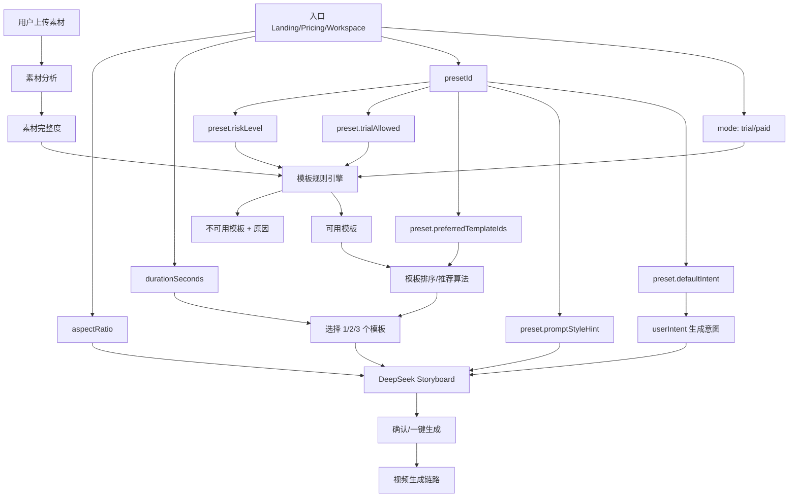

# Style Preset 风格预设设计

版本：MVP 设计确认稿  
日期：2026-06-16  
关联文档：[PRD.md](PRD.md)、[IMPLEMENTATION_PLAN.md](IMPLEMENTATION_PLAN.md)、[DEVELOPMENT_SPEC.md](DEVELOPMENT_SPEC.md)

## 1. 设计结论

Style Preset 是普通用户选择视频风格和用途的主入口。它位于“镜头模板”之上，负责把用户容易理解的目标，例如“极简棚拍”“电商主图动效”“社媒氛围短片”，转换为系统可执行的默认生成意图、模板推荐偏好和 prompt 风格约束。

Preset 不替代镜头模板，也不决定模板是否可用。模板可用性仍由素材分析、镜头模板规则、试用限制、风险等级和产品硬原则共同决定。

必须坚持：

- Preset 负责表达“用户想要什么感觉和用途”。
- 镜头模板负责表达“每个 8 秒片段具体怎么拍”。
- 模板规则引擎负责判断“当前素材允许拍什么”。
- 推荐算法负责在允许范围内选出最合适的 1/2/3 个模板。
- DeepSeek 只能使用最终允许并被系统选中的模板 ID。

一句话原则：

```text
preset 影响模板推荐排序和 prompt 风格基调，但不能绕过模板权限规则。
```

## 2. 为什么需要 Preset

当前工作台暴露的是偏系统内部的生成概念：上传素材、选择时长、选择比例、选择镜头模板、填写生成意图。这个流程可控，但普通服装卖家不一定理解 `front_push_in`、`product_float`、`front_crop_detail` 等模板 ID 背后的差异。

Preset 的目标是降低用户决策成本：

- 普通用户主要选择风格/用途，而不是理解 12 个镜头模板。
- 系统根据素材完整度自动推荐模板组合。
- 模板选择作为“高级调整”折叠展示。
- 保留现有模板规则，继续降低服装细节漂移、背面凭空生成和高风险动作问题。

Preset 不是为了制造“AI 感”，而是为了让工具站更清晰、更稳定、更可控。

## 3. 概念边界

| 概念 | 面向对象 | 作用 | 是否决定模板可用性 |
|---|---|---|---|
| Style Preset | 普通用户 | 选择视频风格/用途，提供默认生成意图和模板偏好 | 否 |
| 生成意图 `userIntent` | 用户/DeepSeek | 表达卖点、场景偏好、风格补充 | 否 |
| 素材分析 | 系统 | 判断图片角色、清晰度、细节、背面、场景、模特等 | 是 |
| 镜头模板 | 系统/高级用户 | 定义每个 8 秒片段的拍法、素材要求和风险 | 是 |
| 模板规则引擎 | 系统 | 输出推荐、可选、不可用模板及原因 | 是 |
| 推荐算法 | 系统 | 在可用模板里按 preset 偏好排序并自动选择 | 是，但不能越权 |
| DeepSeek | 模型 | 生成结构化分镜和视频 prompt | 否，只能引用已选模板 |

错误实现：

```text
用户选 preset -> 直接强行使用 preset 绑定的模板
```

正确实现：

```text
用户选 preset -> preset 给出模板偏好 -> 规则引擎过滤不可用模板 -> 推荐算法在可用模板里排序选择
```

## 4. Preset 与生成意图的关系

Preset 会生成默认“生成意图”，但 preset 不是一段 prompt 文案。

Preset 是结构化配置，至少包含：

- 默认生成意图。
- prompt 风格约束。
- 偏好的模板 ID 列表。
- 不推荐或降权的模板 ID 列表。
- 是否允许试用。
- 默认时长和默认比例。
- 风险等级。

示例：

```ts
type StylePreset = {
  id: string;
  label: string;
  shortDescription: string;
  defaultIntent: string;
  promptStyleHint: string;
  preferredTemplateIds: string[];
  discouragedTemplateIds?: string[];
  trialAllowed: boolean;
  allowedDurationSeconds: Array<8 | 16 | 24>;
  defaultDurationSeconds: 8 | 16 | 24;
  defaultAspectRatio: "9:16" | "1:1" | "16:9";
  riskLevel: "low" | "medium";
};
```

`defaultIntent` 可以自动填入工作台的“生成意图”文本框。用户可以在此基础上补充卖点、场景偏好或品牌语气。

`promptStyleHint` 用于 DeepSeek 分镜和最终视频 prompt 的风格约束，但不能指示 DeepSeek 创造新的模板或越过素材限制。

## 5. Preset 与模板的关系

Preset 与模板是推荐关系，不是替代关系。

```text
Preset = 用户选择的视频风格/用途
Template = 8 秒片段的具体镜头拍法
```

例如用户选择：

```text
Preset: 极简棚拍
时长: 16 秒
比例: 9:16
```

系统可以根据素材情况推荐：

```text
第 1 段: front_push_in
第 2 段: front_pan 或 minimal_studio
```

如果用户没有上传背面图，任何 preset 都不能启用 `back_display` 或 `front_to_back_cut`。

如果用户没有上传细节图，任何 preset 都不能启用 `fabric_macro`、`neckline_closeup`、`cuff_closeup`、`print_closeup` 等细节特写模板。

如果用户选择 `social_lifestyle`，但没有场景图，也不能生成强场景，例如真实街拍、咖啡馆、海边、店铺空间等。最多只能使用通用弱背景和低风险氛围表达。

## 6. 参数关联图



## 7. 用户流程

### 7.1 默认试用入口

```text
Landing CTA
  -> /login?next=/workspace?mode=trial&preset=minimal_studio
  -> 登录完成
  -> /workspace?mode=trial&preset=minimal_studio
```

进入工作台后默认：

- `mode = trial`
- `preset = minimal_studio`
- `durationSeconds = 8`
- `aspectRatio = 9:16`
- `useFreeTrialIfAvailable = true`
- 生成意图填入 `minimal_studio.defaultIntent`

用户仍然必须上传自己的服装素材图。Preset 不提供默认图片，也不应把示例图片送入真实生成链路。

### 7.2 工作台流程

```text
1. 用户选择或沿用 preset。
2. 用户上传正面图，按需补充背面、侧面、细节、场景图。
3. 系统分析素材。
4. 模板规则引擎过滤不可用模板。
5. 推荐算法结合 preset 偏好排序。
6. 系统按时长自动选择 1/2/3 个模板。
7. 用户点击一键生成，或展开“调整镜头”手动微调。
8. DeepSeek 基于已选模板和生成意图生成分镜。
9. Creem Moderation 审核通过后冻结点数或记录试用。
10. 进入视频生成、拼接、Post-QA 和交付流程。
```

### 7.3 模板选择展示策略

普通用户默认不需要手动选择模板。模板区域应作为高级调整能力折叠展示。

建议文案：

```text
已根据你的素材和风格自动选择镜头
[展开调整镜头]
```

展开后显示：

- 推荐模板。
- 可选模板。
- 不可用模板及原因。
- 中高风险模板提示。

不可用模板永远不能选择。

## 8. MVP Preset 列表

MVP 先做 3 个 preset，不要扩大到大量风格标签。

| presetId | 用户名称 | 适合场景 | 默认模板偏好 | 试用 |
|---|---|---|---|---|
| `minimal_studio` | 极简棚拍 | Shopify/独立站商品页，干净展示服装版型 | `minimal_studio`, `front_push_in`, `front_pan`, `front_crop_detail` | 是 |
| `marketplace_clean` | 电商主图动效 | 白底图、平铺图、商品页主图动效 | `product_float`, `front_pan`, `front_crop_detail`, `front_push_in` | 是 |
| `social_lifestyle` | 社媒氛围短片 | TikTok/Reels 测款，轻氛围表达 | `minimal_studio`, `front_push_in`, `front_pan`, `model_front_pose` | 谨慎 |

`social_lifestyle` 风险最高。没有场景图时，不允许生成强场景；没有模特正面图时，不允许启用模特动作模板；试用模式下应优先降级到低风险模板。

暂不做：

- `luxury_fashion_film`
- `runway_model_walk`
- `360_showcase`
- `cinematic_story_ad`

这些 preset 容易诱导走秀、转身、剧情和强场景生成，不适合 MVP 公开链路。

## 9. 推荐算法

输入：

- `presetId`
- `durationSeconds`
- `aspectRatio`
- `billingMode`
- `assetCompleteness`
- `templateCatalog`

步骤：

1. 模板规则引擎先根据素材、试用限制、风险规则过滤不可用模板。
2. 得到 `availableTemplates` 和 `unavailableTemplates`。
3. 根据 `preset.preferredTemplateIds` 对可用模板加权排序。
4. 根据 `preset.discouragedTemplateIds` 对不推荐模板降权。
5. 根据试用模式降低中风险模板优先级，必要时完全禁用。
6. 根据时长自动选择模板数量：
   - 8 秒：1 个模板。
   - 16 秒：2 个模板。
   - 24 秒：3 个模板。
7. 如果 preset 偏好模板不足，从其他低风险可用模板补齐。
8. 如果仍不足，提示素材不足，而不是放开不可用模板。

伪代码：

```ts
function recommendTemplatesForPreset(input: {
  preset: StylePreset;
  durationSeconds: 8 | 16 | 24;
  billingMode: "free_trial" | "paid";
  assetCompleteness: AssetCompleteness;
  templateCatalog: ShotTemplate[];
}) {
  const availability = evaluateTemplateAvailability({
    assetCompleteness: input.assetCompleteness,
    billingMode: input.billingMode,
    templateCatalog: input.templateCatalog,
  });

  const available = availability.templates.filter((template) => template.selectable);

  const sorted = sortByPresetPreference({
    templates: available,
    preferredTemplateIds: input.preset.preferredTemplateIds,
    discouragedTemplateIds: input.preset.discouragedTemplateIds ?? [],
    billingMode: input.billingMode,
  });

  return sorted.slice(0, requiredTemplateCount(input.durationSeconds));
}
```

## 10. 数据保存要求

为了后续分析转化率、成功率、成本和可复现性，任务需要保存 preset 信息。

建议字段：

```text
video_jobs.preset_id
storyboards.preset_id
storyboards.preset_snapshot
```

`preset_snapshot` 应保存任务创建时的 preset 关键配置，例如：

```json
{
  "id": "minimal_studio",
  "label": "极简棚拍",
  "preferredTemplateIds": ["minimal_studio", "front_push_in", "front_pan"],
  "promptStyleHint": "clean studio product video, neutral background, stable garment shape"
}
```

原因：preset 后续可能被调整。如果历史任务只保存 `preset_id`，后续复盘时会丢失当时的推荐策略和 prompt 风格基调。

## 11. 需要新增或调整的配置

MVP 阶段建议先用代码配置，不做后台可编辑 preset。后台编辑容易让运营绕过规则或制造不可复现的历史任务。

建议文件：

```text
src/lib/presets/types.ts
src/lib/presets/catalog.ts
src/lib/presets/recommend.ts
```

后续如需运营配置，再迁移到数据库：

```text
style_presets
style_preset_template_preferences
```

但数据库配置仍必须保留版本、状态、审计和 snapshot，不能做成随意热改的 prompt 标签。

## 12. 前端改动范围

工作台需要：

- 读取 query 参数：
  - `mode=trial`
  - `preset=minimal_studio`
- 新增 preset 选择器。
- 根据 preset 自动设置默认时长、比例和生成意图。
- 根据 preset 自动推荐模板组合。
- 默认隐藏模板细节，折叠到“调整镜头”。
- 一键生成使用系统推荐模板。

Landing / Pricing CTA 可以进入：

```text
/login?next=/workspace?mode=trial&preset=minimal_studio
```

已登录用户可以直接进入：

```text
/workspace?mode=trial&preset=minimal_studio
```

## 13. 后端改动范围

后端需要：

- `POST /api/jobs` 接收并校验 `presetId`。
- 创建 `video_jobs` 时保存 `preset_id`。
- `POST /api/jobs/[id]/storyboard` 读取 job 的 preset，或接收已校验 preset。
- 生成 storyboard 时把 `preset.defaultIntent`、`preset.promptStyleHint` 和已选模板一起传入。
- 保存 `storyboards.preset_snapshot`。
- `GET /api/jobs/[id]` 返回 preset 信息和基于 preset 排序后的推荐模板。
- 管理后台任务详情展示 preset 和 preset snapshot。

不应改动：

- Preset 不改变素材分析事实。
- Preset 不改变模板可用性硬规则。
- Preset 不绕过 Creem Moderation。
- Preset 不绕过 Post-QA。
- Preset 不让普通用户选择具体 provider/model。

## 14. 验收标准

功能验收：

- 未选择 preset 时默认使用 `minimal_studio`。
- `/workspace?mode=trial&preset=minimal_studio` 默认 8 秒、9:16、试用模式。
- preset 默认生成意图正确填入工作台。
- 上传素材后，模板推荐顺序受 preset 影响。
- 不可用模板仍然不可选，并展示原因。
- 用户可以一键生成，不必手动选择模板。
- 高级调整展开后可以替换为其他可用模板。
- DeepSeek 只收到最终允许并被系统选中的模板 ID。
- `video_jobs` / `storyboards` 保存 preset 信息或 snapshot。
- 管理后台可查看任务使用的 preset。

风险验收：

- 无背面图时，即使 preset 偏好背面相关风格，也不能启用背面展示、正背切换、转身或 360。
- 无细节图时，即使 preset 偏好细节展示，也不能启用细节特写。
- 无场景图时，`social_lifestyle` 不能生成强场景。
- 免费试用只使用低风险模板。
- Preset 文案不能诱导用户以为系统会补齐不存在的服装细节。

验证建议：

- 只改 Landing、Pricing、preset UI 时，跑 `npm run typecheck` 和相关前端测试即可。
- 改 job 创建、storyboard、模板推荐或确认生成链路后，必须补充单测。
- 新流程准备给真实用户试用前，必须跑 smoke / blocker 验收。

## 15. 实施阶段建议

第一阶段：Preset 配置与工作台体验

- 新增 `src/lib/presets/*`。
- 工作台支持读取 `mode` 和 `preset` query。
- 新增 preset 选择器。
- preset 自动填充生成意图。
- 模板推荐排序受 preset 影响。
- 模板选择默认折叠为高级调整。

第二阶段：数据保存与分镜接入

- `video_jobs` 保存 `preset_id`。
- `storyboards` 保存 `preset_id` 和 `preset_snapshot`。
- DeepSeek 输入包含 preset 风格约束。
- 管理后台展示 preset。

第三阶段：Public Site 转化入口

- Landing CTA 带 `mode=trial&preset=minimal_studio`。
- Pricing 入口带不同 preset 或 paid mode。
- 未登录用户通过 `next` 登录后回到 workspace。

第四阶段：统计与优化

- 统计每个 preset 的上传率、分镜确认率、生成成功率、下载率、付费转化率、平均成本和失败原因。
- 根据真实数据调整 preset 的模板偏好，不根据主观审美随意改 prompt。

## 16. 禁止事项

- 禁止把 preset 仅实现为一段 prompt 文案。
- 禁止让 DeepSeek 根据用户意图自由创造模板。
- 禁止让 preset 直接越过模板规则启用高风险镜头。
- 禁止因为用户选择“社媒氛围”就生成素材中不存在的场景、背面、细节或模特动作。
- 禁止在 MVP 阶段开放后台随意编辑 preset prompt。
- 禁止把 preset 做成大量泛泛风格标签，导致用户选择困难和统计样本稀释。

